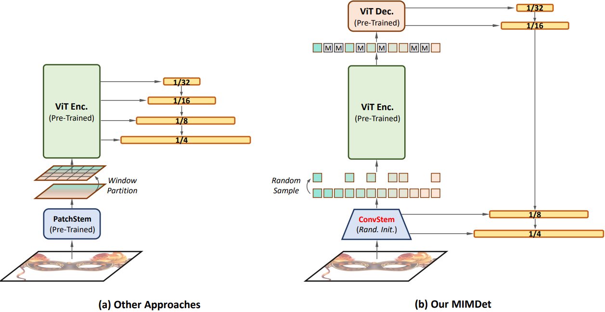
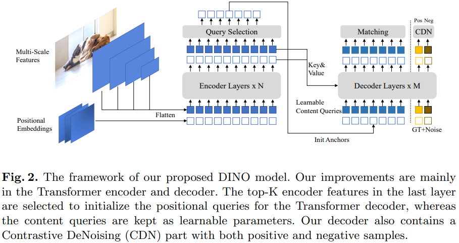
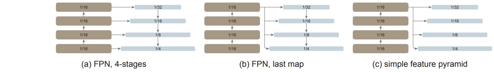
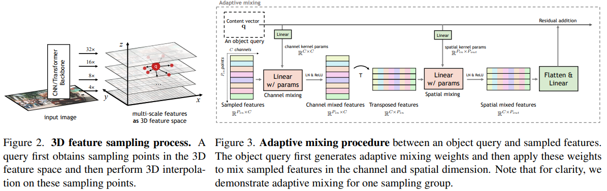
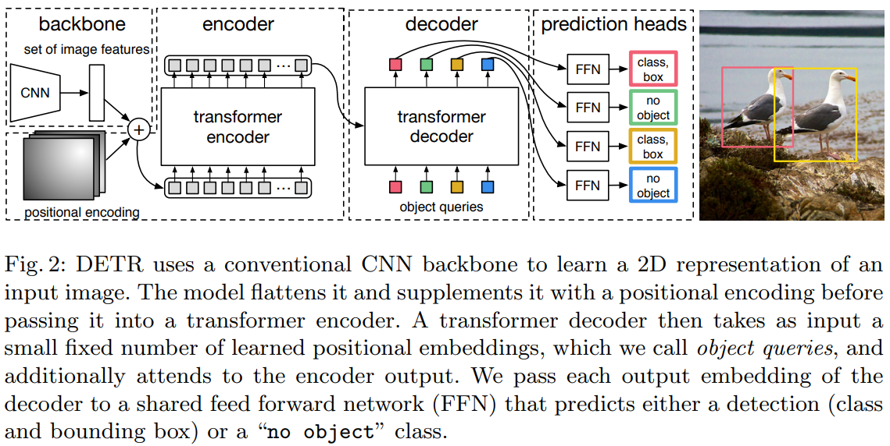

 
# Detection Papers 

## Review materials
[[综述：目标检测二十年（2001-2021）](https://mp.weixin.qq.com/s/cWCwcTA01oBy0BM3qRHb4Q)]  
[[Ranking list on COCO test-dev](https://paperswithcode.com/sota/object-detection-on-coco)]  
[[Anchor free detectors](https://mp.weixin.qq.com/s/NRu7PhDW52vZVFiFLA3xhg)]  
[[detection-transformer-list](https://github.com/IDEACVR/awesome-detection-transformer)]

---
## Transformer-based Object Detection

+ **MIMDET** Unleashing Vanilla Vision Transformer with Masked Image Modeling for Object Detection. arXiv 2022-04  
Yuxin Fang, Shusheng Yang, Shijie Wang, Yixiao Ge, Ying Shan, Xinggang Wang   
[[paper](https://arxiv.org/pdf/2204.02964.pdf)] [[code](https://github.com/hustvl/MIMDet)]
  

    
Notes

       

    - Key points:
         - With randomly sampled partial observations (25%-50%), the ViT model pretrained using MIM works well for object detection.
         - Using the features of both ViT and CNNs to generate a feature pyramid for detection.
    - Performance:
         - 51.5 AP on COCO val2017   
    

+ DINO: DETR with Improved DeNoising Anchor Boxes for End-to-End Object Detection. arXiv 2022-03  
Hao Zhang, Feng Li, Shilong Liu, Lei Zhang, Hang Su, Jun Zhu, Lionel M. Ni, Heung-Yeung Shum   
[[paper](https://arxiv.org/abs/2203.03605)] [[code](https://github.com/IDEACVR/DINO)]
  

    
Notes

       

    - Key points:
         - A contrastive way for denoising training, a mixed query selection method for anchor initialization, and a forward twice scheme for box prediction.  
    - Performance:
         - 63.2 AP on COCO val2017 with a SiwnL backbone
         - 63.3 AP on test-dev
    

+ Exploring Plain Vision Transformer Backbones for Object Detection.  arXiv 2022-03  
Yanghao Li, Hanzi Mao, Ross Girshick, Kaiming He  
[[paper](https://arxiv.org/pdf/2203.16527.pdf)] [code]
  

    
Notes

       

    - Key points:
         - Exploring a plain, non-hierarchical vision transformer as the backbone network for object detection.
         - Using window attention aided with very few cross-window propagation blocks is sufficient for information interaction.
    - Performance:
         - 60.4 AP(box) on COCO, with ViT-H backbone (MAE pretraining on 1K) and Cascade framework.
    

+ DAB-DETR: Dynamic Anchor Boxes are Better Queries for DETR. ICLR 2022   
Shilong Liu, Feng Li, Hao Zhang, Xiao Yang, Xianbiao Qi, Hang Su, Jun Zhu, Lei Zhang    
[[paper](https://arxiv.org/abs/2201.12329)]  [[code](https://github.com/SlongLiu/DAB-DETR)]  

+ DN-DETR: Accelerate DETR Training by Introducing Query DeNoising. CVPR 2022  
Feng Li, Hao Zhang, Shilong Liu, Jian Guo, Lionel M. Ni, Lei Zhang  
[[paper](https://arxiv.org/pdf/2203.01305.pdf)]  [[code](https://github.com/IDEA-opensource/DN-DETR)]  [[related materials](https://zhuanlan.zhihu.com/p/478079763)]  

+ Accelerating DETR Convergence via Semantic-Aligned Matching. CVPR 2022  
Gongjie Zhang, Zhipeng Luo, Yingchen Yu, Kaiwen Cui, Shijian Lu  
[[paper](https://arxiv.org/abs/2203.06883)]  [[code](https://github.com/ZhangGongjie/SAM-DETR)]  [[related materials](https://zhuanlan.zhihu.com/p/489839282)]  

+ AdaMixer: A Fast-Converging Query-Based Object Detector. CVPR 2022  
Ziteng Gao, Limin Wang, Bing Han, Sheng Guo  
[[paper](https://arxiv.org/pdf/2203.16507.pdf)] [[code](https://github.com/MCG-NJU/AdaMixer)]  
  

    
Notes

       

    - Key points:
         - Improving the adaptability of the decoder processes in a) each query sample features over space and scales based on estimated offsets; b) decoding these sampled features with an adaptive MLP-mixer under the guidance of each query.
  
    - Performance:
         - 51.3 AP(box) on COCO minival.
    

+ Few-Shot Object Detection with Fully Cross-Transformer. CVPR 2022  
Guangxing Han, Jiawei Ma, Shiyuan Huang, Long Chen, Shih-Fu Chang  
[[paper](https://arxiv.org/pdf/2203.15021.pdf)]    

+ Multi-Granularity Alignment Domain Adaptation for Object Detection. CVPR 2022  
Wenzhang Zhou, Dawei Du, Libo Zhang, Tiejian Luo, Yanjun Wu  
[[paper](https://arxiv.org/pdf/2203.16897.pdf)]  [[code](https://github.com/tiankongzhang/MGADA)]  

+ UP-DETR: Unsupervised Pre-training for Object Detection with Transformers. CVPR 2021  
Zhigang Dai, Bolun Cai, Yugeng Lin, Junying Chen.
[[paper](https://arxiv.org/pdf/2011.09094)]  [[code](https://github.com/dddzg/up-detr)]

+ Deformable DETR: Deformable Transformers for End-to-End Object Detection. CVPR 2021    
Xizhou Zhu, Weijie Su, Lewei Lu, Bin Li, Xiaogang Wang, Jifeng Dai.  
[[paper](https://arxiv.org/pdf/2010.04159.pdf)]  [[code](https://github.com/fundamentalvision/Deformable-DETR)]

+ Adaptive Image Transformer for One-Shot Object Detection. CVPR 2021  

+ **DETR**  - End-to-end object detection with transformers. ECCV2020  
Nicolas Carion, Francisco Massa, Gabriel Synnaeve, Nicolas Usunier, Alexander Kirillov, Sergey Zagoruyko.
[[paper](https://www.ecva.net/papers/eccv_2020/papers_ECCV/papers/123460205.pdf)]  [[code](https://github.com/facebookresearch/detr)]
  

    
Notes

       

    - Key points:
         - Casting object detection as a set prediction problem and solving it with a set-based global loss that forces unique predictions via bipartite matching under a transformer encoder-decoder architecture.  
         - Given a small set of learned object queries, DETR reasons about the relations of the objects and the global image context to output the prediction set in parallel.
  
    - Performance:
         - 45.1 AP(box) on COCO 2017val, with the res101 backbone.
    

--- 
## Semi-Supervised, UN-supervised, and self-supervised Object Detection

### ArXiv 2022  

+ Sparsely Annotated Object Detection: A Region-based Semi-supervised Approach  
Sai Saketh Rambhatla, Saksham Suri, Rama Chellappa, Abhinav Shrivastava  
[[paper](https://arxiv.org/pdf/2201.04620)] 

### CVPR 2022  
+ Sylph: A Hypernetwork Framework for Incremental Few-shot Object Detection  
Li Yin, Juan M Perez-Rua, Kevin J Liang  
[[paper](https://arxiv.org/pdf/2203.13903.pdf)] 

### ArXiv 2021

+ CutPaste: Self-Supervised Learning for Anomaly Detection and Localization  
Chun-Liang Li, Kihyuk Sohn, Jinsung Yoon, Tomas Pfister  
[[paper](https://arxiv.org/pdf/2104.04015.pdf)] 

+ End-to-End Semi-Supervised Object Detection with Soft Teacher   
Mengde Xu, Zheng Zhang, Han Hu, Jianfeng Wang, Lijuan Wang, Fangyun Wei, Xiang Bai, Zicheng Liu   
[[paper](https://arxiv.org/pdf/2106.09018.pdf)]  [[code]()]  

### CVPR 2021  
+ Instant-Teaching: An End-to-End Semi-Supervised Object Detection Framework  
Qiang Zhou, Chaohui Yu, Zhibin Wang, Qi Qian, Hao Li  
[[paper](https://arxiv.org/abs/2103.11402)] 

+ Data-Uncertainty Guided Multi-Phase Learning for Semi-Supervised Object Detection  
Zhenyu Wang, Yali Li, Ye Guo, Lu Fang, Shengjin Wang  
[[paper](https://arxiv.org/pdf/2103.16368.pdf)]

+ Interactive Self-Training With Mean Teachers for Semi-Supervised Object Detection
Qize Yang, Xihan Wei, Biao Wang, Xian-Sheng Hua, Lei Zhang
[[paper](http://www4.comp.polyu.edu.hk/~cslzhang/paper/ISMT-cvpr21.pdf)]

+ Points as Queries: Weakly Semi-supervised Object Detection by Points
Liangyu Chen, Tong Yang, Xiangyu Zhang, Wei Zhang, Jian Sun
[[paper](https://arxiv.org/pdf/2104.07434.pdf)]

+ Interpolation-based semi-supervised learning for object detection
Jisoo Jeong, Vikas Verma, Minsung Hyun, Juho Kannala, Nojun Kwak
[[paper](https://arxiv.org/pdf/2006.02158.pdf)]   [[code](https://github.com/soo89/CSD-SSD)]

+ DAP: Detection-Aware Pre-training with Weak Supervision
Yuanyi Zhong, Jianfeng Wang, Lijuan Wang, Jian Peng, Yu-Xiong Wang, Lei Zhang
[[paper](https://arxiv.org/pdf/2103.16651.pdf)]

+ Instance Localization for Self-supervised Detection Pretraining
Ceyuan Yang, Zhirong Wu, Bolei Zhou, Stephen Lin
[[paper](https://arxiv.org/pdf/2102.08318.pdf)]  [[code](https://github.com/limbo0000/InstanceLoc)]

+ Leveraging Large-Scale Weakly Labeled Data for Semi-Supervised Mass Detection in Mammograms

+ Humble Teachers Teach Better Students for Semi-Supervised Object Detection  
Yihe Tang, Weifeng Chen, Yijun Luo, Yuting Zhang  
[[paper](https://arxiv.org/pdf/2106.10456.pdf)]  [[code](https://github.com/lryta/HumbleTeacher)]

--- 
## 3D Object Detection

+ CAT-Det: Contrastively Augmented Transformer for Multi-modal 3D Object Detection. CVPR 2022 
Yanan Zhang, Jiaxin Chen, Di Huang  
[[paper](https://arxiv.org/pdf/2204.00325)]  [code]

--- 
## Dense Object Detection

### CVPR 2022   
+ Localization Distillation for Dense Object Detection   
Zhaohui Zheng, Rongguang Ye, Ping Wang, Dongwei Ren, Wangmeng Zuo, Qibin Hou, Ming-Ming Cheng    
[[paper](https://arxiv.org/abs/2102.12252)]   [[code](https://github.com/HikariTJU/LD)]   

### CVPR 2021  
+ Generalized Focal Loss V2: Learning Reliable Localization Quality Estimation for Dense Object Detection
Xiang Li, Wenhai Wang, Xiaolin Hu, Jun Li, Jinhui Tang, Jian Yang
[[paper](https://arxiv.org/pdf/2011.12885.pdf)]   [[code](https://github.com/implus/GFocalV2)]

+ VarifocalNet: An IoU-aware Dense Object Detector
Haoyang Zhang, Ying Wang, Feras Dayoub, Niko Sünderhauf
[[paper](https://arxiv.org/pdf/2008.13367.pdf)] [[code](https://github.com/hyz-xmaster/VarifocalNet)]

---  
## Domain Adaption

### CVPR 2021
+ Instance-Invariant Domain Adaptive Object Detection via Progressive Disentanglement
Aming Wu, Yahong Han, Linchao Zhu, Yi Yang
[[paper](https://arxiv.org/pdf/1911.08712.pdf)]

+ Domain-Specific Suppression for Adaptive Object Detection
Yu Wang, Rui Zhang, Shuo Zhang, Miao Li, YangYang Xia, XiShan Zhang, ShaoLi Liu
[[paper](https://arxiv.org/pdf/2105.03570.pdf)]

+ Unbiased Mean Teacher for Cross Domain Object Detection
Jinhong Deng, Wen Li, Yuhua Chen, Lixin Duan
[[paper](https://arxiv.org/pdf/2003.00707.pdf)] [[code](https://github.com/kinredon/umt)]

+ MeGA-CDA: Memory Guided Attention for Category-Aware Unsupervised Domain Adaptive Object Detection
Vibashan VS, Vikram Gupta, Poojan Oza, Vishwanath A. Sindagi, Vishal M. Patel
[[paper](https://arxiv.org/pdf/2103.04224)]

---  
## New Framework

### CVPR 2021
+ Object Detection as a Positive-Unlabeled Problem
Yuewei Yang, Kevin J Liang, Lawrence Carin
[[paper](https://arxiv.org/pdf/2002.04672.pdf)]  [[code](https://github.com/ggjy/DeFeat.pytorch)] 

+ DetectoRS: Detecting Objects with Recursive Feature Pyramid and Switchable Atrous Convolution
Siyuan Qiao, Liang-Chieh Chen, Alan Yuille
[[paper](https://arxiv.org/pdf/2006.02334.pdf)]  [[code](https://github.com/joe-siyuan-qiao/DetectoRS)]

+ I3Net: Implicit Instance-Invariant Network for Adapting One-Stage Object Detectors
Chaoqi Chen, Zebiao Zheng, Yue Huang, Xinghao Ding, Yizhou Yu
[[paper](https://arxiv.org/pdf/2103.13757.pdf)]   [[code](https://github.com/implus/GFocalV2)]

+ Sparse R-CNN: End-to-End Object Detection with Learnable Proposals
Peize Sun, Rufeng Zhang, Yi Jiang, Tao Kong, Chenfeng Xu, Wei Zhan, Masayoshi Tomizuka, Lei Li, Zehuan Yuan, Changhu Wang, Ping Luo
[[paper](https://arxiv.org/pdf/2011.12450.pdf)] [[code](https://github.com/PeizeSun/SparseR-CNN)]

+ End-to-End Object Detection with Fully Convolutional Network
Jianfeng Wang, Lin Song, Zeming Li, Hongbin Sun, Jian Sun, Nanning Zheng
[[paper](https://arxiv.org/pdf/2012.03544.pdf)] [[code](https://github.com/Megvii-BaseDetection/DeFCN)]

+ You Only Look One-level Feature
Qiang Chen, Yingming Wang, Tong Yang, Xiangyu Zhang, Jian Cheng, Jian Sun
[[paper](https://arxiv.org/pdf/2103.09460.pdf)]  [[code](https://github.com/megvii-model/YOLOF)]

+ AQD: Towards Accurate Quantized Object Detection.
Peng Chen, Jing Liu, Bohan Zhuang, Mingkui Tan, Chunhua Shen.
[[paper](https://arxiv.org/pdf/2007.06919.pdf)]  [[code](https://github.com/aim-uofa/model-quantization)]

--- 
## Few-Shot

### CVPR 2021  
+ Dense Relation Distillation with Context-aware Aggregation for Few-Shot Object Detection
Hanzhe Hu, Shuai Bai, Aoxue Li, Jinshi Cui, Liwei Wang
[[paper](https://arxiv.org/pdf/2103.17115.pdf)]  [[code](https://github.com/hzhupku/DCNet)]

+ Hallucination Improves Few-Shot Object Detection
Weilin Zhang, Yu-Xiong Wang
[[paper](https://arxiv.org/pdf/2105.01294.pdf)] [[code](https://github.com/pppplin/HallucFsDet)]

+ Semantic Relation Reasoning for Shot-Stable Few-Shot Object Detection
Chenchen Zhu, Fangyi Chen, Uzair Ahmed, Zhiqiang Shen, Marios Savvides
[[paper](https://arxiv.org/pdf/2103.01903.pdf)]

+ FSCE: Few-Shot Object Detection via Contrastive Proposal Encoding
Bo Sun, Banghuai Li, Shengcai Cai, Ye Yuan, Chi Zhang
[[paper](https://arxiv.org/pdf/2103.05950.pdf)]  [[code](https://github.com/MegviiDetection/FSCE)]

+ Beyond Max-Margin: Class Margin Equilibrium for Few-shot Object Detection
Bohao Li, Boyu Yang, Chang Liu, Feng Liu, Rongrong Ji, Qixiang Ye
[[paper](https://arxiv.org/pdf/2103.04612.pdf)] [[code](https://github.com/BohaoLee/CME)]

+ Generalized Few-Shot Object Detection without Forgetting
Zhibo Fan, Yuchen Ma, Zeming Li, Jian Sun
[[paper](https://arxiv.org/pdf/2105.09491.pdf)]

+ Few-Shot Object Detection via Classification Refinement and Distractor Retreatment

+ Accurate Few-Shot Object Detection With Support-Query Mutual Guidance and Hybrid Loss

+ Transformation Invariant Few-Shot Object Detection

--- 
## Lightweight (distillation and NAS)

### CVPR 2021  
+ MobileDets: Searching for Object Detection Architectures for Mobile Accelerators
Yunyang Xiong, Hanxiao Liu, Suyog Gupta, Berkin Akin, Gabriel Bender, Yongzhe Wang, Pieter-Jan Kindermans, Mingxing Tan, Vikas Singh, Bo Chen
[[paper](https://arxiv.org/pdf/2004.14525.pdf)]  [[code](https://github.com/tensorflow/models/tree/master/research/object_detection)]

+ General Instance Distillation for Object Detection
Xing Dai, Zeren Jiang, Zhao Wu, Yiping Bao, Zhicheng Wang, Si Liu, Erjin Zhou
[[paper](https://arxiv.org/pdf/2103.02340.pdf)]

+ Joint-DetNAS: Upgrade Your Detector with NAS, Pruning and Dynamic Distillation
Lewei Yao, Renjie Pi, Hang Xu, Wei Zhang, Zhenguo Li, Tong Zhang  \
[[paper](https://arxiv.org/pdf/2105.12971.pdf)]

+ OPANAS: One-Shot Path Aggregation Network Architecture Search for Object Detection
Tingting Liang, Yongtao Wang, Zhi Tang, Guosheng Hu, Haibin Ling
[[paper](https://arxiv.org/pdf/2103.04507.pdf)]  [[code](https://github.com/VDIGPKU/OPANAS)]

+ Distilling Object Detectors via Decoupled Features
Jianyuan Guo, Kai Han, Yunhe Wang, Han Wu, Xinghao Chen, Chunjing Xu, Chang Xu
[[paper](https://arxiv.org/pdf/2103.14475.pdf)]  [[code](https://github.com/ggjy/DeFeat.pytorch)]

--- 
## Long-tail

### CVPR 2021  
+ Adaptive Class Suppression Loss for Long-Tail Object Detection
Tong Wang, Yousong Zhu, Chaoyang Zhao, Wei Zeng, Jinqiao Wang, Ming Tang
[[paper](https://arxiv.org/pdf/2104.00885.pdf)]  [[code](https://github.com/CASIA-IVA-Lab/ACSL)]

+ Equalization Loss v2: A New Gradient Balance Approach for Long-tailed Object Detection
Jingru Tan, Xin Lu, Gang Zhang, Changqing Yin, Quanquan Li
[[paper](https://arxiv.org/pdf/2012.08548.pdf)]  [[code](https://github.com/tztztztztz/eqlv2)]

--- 
## training method

### CVPR 2021  
+ IQDet: Instance-wise Quality Distribution Sampling for Object Detection  
Yuchen Ma, Songtao Liu, Zeming Li, Jian Sun  
[[paper](https://arxiv.org/pdf/2104.06936.pdf)]

+ Multiple instance active learning for object detection  
Tianning Yuan, Fang Wan, Mengying Fu, Jianzhuang Liu, Songcen Xu, Xiangyang Ji, Qixiang Ye   
[[paper](https://arxiv.org/pdf/2104.02324.pdf)]  [[code](https://github.com/yuantn/MI-AOD)]

+ Scale-aware Automatic Augmentation for Object Detection  
Yukang Chen, Yanwei Li, Tao Kong, Lu Qi, Ruihang Chu, Lei Li, Jiaya Jia  
[[paper](https://arxiv.org/pdf/2103.17220.pdf)]  [[code](https://github.com/Jia-ResearchLab/SA-AutoAug)]

+ Class-Aware Robust Adversarial Training for Object Detection  
Pin-Chun Chen, Bo-Han Kung, Jun-Cheng Chen  
[[paper](https://arxiv.org/pdf/2103.16148.pdf)]

+ Robust and Accurate Object Detection via Adversarial Learning  
Xiangning Chen, Cihang Xie, Mingxing Tan, Li Zhang, Cho-Jui Hsieh, Boqing Gong  
[[paper](https://arxiv.org/pdf/2103.13886.pdf)] [[code](https://github.com/google/automl/blob/master/efficientdet/Det-AdvProp.md)]

--- 
## Specific object\problem detection
### CVPR 2021
+ CRFace: Confidence Ranker for Model-Agnostic Face Detection Refinement.  
Noranart Vesdapunt, Baoyuan Wang.  
[[paper](https://arxiv.org/pdf/2103.07017.pdf)]

+ Improved Handling of Motion Blur in Online Object Detection  
Mohamed Sayed, Gabriel Brostow  
[[paper](https://arxiv.org/pdf/2011.14448.pdf)]  

+ PANDA: Adapting Pretrained Features for Anomaly Detection and Segmentation  
Tal Reiss, Niv Cohen, Liron Bergman, Yedid Hoshen  
[[paper](https://arxiv.org/pdf/2010.05903.pdf)]  [[code](github.com/talreiss/PANDA)] 

+ Towards Open World Object Detection  
K J Joseph, Salman Khan, Fahad Shahbaz Khan, Vineeth N Balasubramanian  
[[paper](https://arxiv.org/pdf/2103.02603.pdf)]  [[code](https://github.com/JosephKJ/OWOD)]

+ UniT: Unified Knowledge Transfer for Any-shot Object Detection and Segmentation  
Siddhesh Khandelwal, Raghav Goyal, Leonid Sigal  
[[paper](https://arxiv.org/pdf/2006.07502.pdf)] 

+ Dogfight: Detecting Drones from Drones Videos  
Muhammad Waseem Ashraf, Waqas Sultani, Mubarak Shah  
[[paper](https://arxiv.org/pdf/2103.17242.pdf)] 

+ Detection, Tracking, and Counting Meets Drones in Crowds: A Benchmark  
Longyin Wen, Dawei Du, Pengfei Zhu, Qinghua Hu, Qilong Wang, Liefeng Bo, Siwei Lyu  
[[paper](https://arxiv.org/pdf/2105.02440.pdf)] [[code](https://github.com/VisDrone/DroneCrowd)]

+ Generalizable Pedestrian Detection: The Elephant In The Room  
Irtiza Hasan, Shengcai Liao, Jinpeng Li, Saad Ullah Akram, Ling Shao  
[[paper](https://arxiv.org/pdf/2003.08799.pdf)]  [[code](https://github.com/hasanirtiza/PedestronS)]

+ Black-box Explanation of Object Detectors via Saliency Maps  
Vitali Petsiuk, Rajiv Jain, Varun Manjunatha, Vlad I. Morariu, Ashutosh Mehra, Vicente Ordonez, Kate Saenko  
[[paper](https://arxiv.org/pdf/2006.03204.pdf)]  

+ Variational Pedestrian Detection  
Yuang Zhang, Huanyu He, Jianguo Li, Yuxi Li, John See, Weiyao Lin  
[[paper](https://arxiv.org/pdf/2104.12389.pdf)]  

+ MOOD: Multi-level Out-of-distribution Detection  
Ziqian Lin, Sreya Dutta Roy, Yixuan Li  
[[paper](https://arxiv.org/pdf/2104.14726.pdf)] [[code](https://github.com/deeplearning-wisc/MOOD)]

+ A Closer Look at Fourier Spectrum Discrepancies for CNN-generated Images Detection  
Keshigeyan Chandrasegaran, Ngoc-Trung Tran, Ngai-Man Cheung  
[[paper](https://arxiv.org/pdf/2103.17195.pdf)] [[code](https://keshik6.github.io/FourierDiscrepancies-CNN-Detection/)]

+ OTA: Optimal Transport Assignment for Object Detection  
Zheng Ge, Songtao Liu, Zeming Li, Osamu Yoshie, Jian Sun  
[[paper](https://arxiv.org/pdf/2103.14259.pdf)] [[code](https://github.com/Megvii-BaseDetection/OTA)]

## Localization
+ Bridging the Gap between Classification and Localization for Weakly Supervised Object Localization. CVPR 2022  
Eunji Kim, Siwon Kim, Jungbeom Lee, Hyunwoo Kim, Sungroh Yoon   
[[paper](https://arxiv.org/pdf/2203.13249.pdf)] [code]

--- 
## Unclassified  
### arXiv 2022  
+ BigDetection: A Large-scale Benchmark for Improved Object Detector Pre-training  
Likun Cai, Zhi Zhang, Yi Zhu, Li Zhang, Mu Li, Xiangyang Xue   
[[paper](https://arxiv.org/pdf/2203.13249.pdf)] [[code]()]

+ PP-YOLOE: An evolved version of YOLO  
Shangliang Xu, Xinxin Wang, Wenyu Lv, Qinyao Chang, Cheng Cui, Kaipeng Deng, Guanzhong Wang, Qingqing Dang, Shengyu Wei, Yuning Du, Baohua Lai  
[[paper](https://arxiv.org/pdf/2203.13249.pdf)] [[code](https://github.com/PaddlePaddle/PaddleDetection)]

### CVPR 2022  
+ Proper Reuse of Image Classification Features Improves Object Detection  
Cristina Vasconcelos, Vighnesh Birodkar, Vincent Dumoulin   
[[paper](https://arxiv.org/pdf/2204.00484.pdf)] [[code](https://github.com/tensorflow/models/blob/master/official/projects/backbone_reuse/README.md)]  

+ Expanding Low-Density Latent Regions for Open-Set Object Detection  
Jiaming Han, Yuqiang Ren, Jian Ding, Xingjia Pan, Ke Yan, Gui-Song Xia   
[[paper](https://arxiv.org/pdf/2106.08713.pdf)]

+ Optimal Correction Cost for Object Detection Evaluation    
Mayu Otani, Riku Togashi, Yuta Nakashima, Esa Rahtu, Janne Heikkilä, Shin'ichi Satoh   
[[paper](https://arxiv.org/pdf/2203.14438.pdf)]

### ArXiv 2021   
+ 2nd Place Solution for Waymo Open Dataset Challenge — Real-time 2D Object Detection 
Yueming Zhang, Xiaolin Song, Bing Bai, Tengfei Xing, Chao Liu, Xin Gao, Zhihui Wang, Yawei Wen, Haojin Liao, Guoshan Zhang, Pengfei Xu  
[[paper](https://arxiv.org/pdf/2203.14911.pdf)] [[code](https://github.com/csuhan/opendet2)]  

+ Towards Total Recall in Industrial Anomaly Detection  
[[paper](https://arxiv.org/pdf/2106.08265.pdf)]

+ MDETR - Modulated Detection for End-to-End Multi-Modal Understanding    
Zheng Ge, Songtao Liu, Feng Wang, Zeming Li, Jian Sun   
[[paper](https://arxiv.org/abs/2104.12763)] [[code](https://github.com/ashkamath/mdetr)] [[ruanwen](https://mp.weixin.qq.com/s/FYKkRVrmCajlzfxIABVEOg)] 

+ YOLOX: Exceeding YOLO Series in 2021  
Zheng Ge, Songtao Liu, Feng Wang, Zeming Li, Jian Sun   
[[paper](https://arxiv.org/pdf/2107.08430.pdf)] [[code](https://github.com/Megvii-BaseDetection/YOLOX)] 

+ CBNetV2: A Composite Backbone Network Architecture for Object Detection  
Tingting Liang, Xiaojie Chu, Yudong Liu, Yongtao Wang, Zhi Tang, Wei Chu, Jingdong Chen, Haibin Ling  
[[paper](https://arxiv.org/pdf/2107.00420.pdf)] [[code]( https://github.com/VDIGPKU/CBNetV2)]  

### CVPR 2021   
+ RPN Prototype Alignment for Domain Adaptive Object Detector  

+ Informative and Consistent Correspondence Mining for Cross-Domain Weakly Supervised Object Detection  

+ Beyond Bounding-Box: Convex-Hull Feature Adaptation for Oriented and Densely Packed Object Detection  

+ Dynamic Head: Unifying Object Detection Heads With Attentions  
Xiyang Dai, Yinpeng Chen, Bin Xiao, Dongdong Chen, Mengchen Liu, Lu Yuan, Lei Zhang  
[[paper](https://openaccess.thecvf.com/content/CVPR2021/papers/Dai_Dynamic_Head_Unifying_Object_Detection_Heads_With_Attentions_CVPR_2021_paper.pdf)] [[code](https://github.com/microsoft/DynamicHead)]

+ Layer-Wise Searching for 1-Bit Detectors  

+ Positive-Unlabeled Data Purification in the Wild for Object Detection  

+ GAIA: A Transfer Learning System of Object Detection That Fits Your Needs.  

+ RankDetNet: Delving Into Ranking Constraints for Object Detection.

### Related fields
+ Generalized Domain Adaptation  
Yu Mitsuzumi Go Irie Daiki Ikami Takashi Shibata  
[[paper](https://arxiv.org/pdf/2106.01656.pdf)]  [[code](https://github.com/nttcslab/Generalized-Domain-Adaptation)]  

