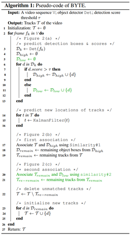
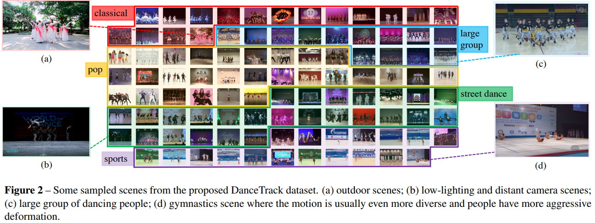

# MOT Papers

## arXiv 2022  
+ BoT-SORT: Robust Associations Multi-Pedestrian Tracking (arXiv 2022-07)  
Nir Aharon, Roy Orfaig, Ben-Zion Bobrovsky   
[[paper](https://arxiv.org/abs/2206.14651)]  [[code](https://github.com/NirAharon/BOT-SORT)]

+ Observation-Centric SORT: Rethinking SORT for Robust Multi-Object Tracking (arXiv 2022-03)  
Jinkun Cao, Xinshuo Weng, Rawal Khirodkar, Jiangmiao Pang, Kris Kitani   
[[paper](https://arxiv.org/pdf/2203.14360.pdf)]  [[code](https://github.com/noahcao/OC_SORT)]

+ TR-MOT: Multi-Object Tracking by Reference (arXiv 2022-03)  
Mingfei Chen, Yue Liao, Si Liu, Fei Wang, Jenq-Neng Hwang   
[[paper](https://arxiv.org/pdf/2203.16621.pdf)]  [code]  

## ECCV 2022  

+ ByteTrack: Multi-Object Tracking by Associating Every Detection Box (arXiv 2021-10)  
Yifu Zhang, Peize Sun, Yi Jiang, Dongdong Yu, Zehuan Yuan, Ping Luo, Wenyu Liu, Xinggang Wang  
[[paper](https://arxiv.org/abs/2110.06864)]  [[code](https://github.com/ifzhang/ByteTrack)]  
  

    
Notes

       

    - Key points:
         - Low score detection boxes are also associated based on their similarities (IoU) with tracklets to recover true objects and filter out background detections.
         - SOTA performance. MOTA 80.3 HOTA 63.1 on MOT17 and MOTA 77.8 HOTA 61.3 on MOT20.
    

## CVPR 2022  

+ Adiabatic Quantum Computing for Multi Object Tracking. CVPR 2022  
Jan-Nico Zaech, Alexander Liniger, Martin Danelljan, Dengxin Dai, Luc Van Gool   
[[paper](https://openaccess.thecvf.com/content/CVPR2022/papers/Zaech_Adiabatic_Quantum_Computing_for_Multi_Object_Tracking_CVPR_2022_paper.pdf)]  

+ DanceTrack: Multi-Object Tracking in Uniform Appearance and Diverse Motion. CVPR 2022  
Peize Sun, Jinkun Cao, Yi Jiang, Zehuan Yuan, Song Bai, Kris Kitani, Ping Luo   
[[paper](https://arxiv.org/abs/2111.14690)] [[code](https://github.com/DanceTrack/DanceTrack)]
  

    
Notes

       

    - Key points:
         - Proposing a large-scale dataset for multi-human tracking, where humans have similar appearance, diverse motion and extreme articulation.
         - Benchmarking several state-of-the-art trackers on the proposed dataset.
    

+ Global Tracking Transformers. CVPR 2022  
Xingyi Zhou, Tianwei Yin, Vladlen Koltun, Phillip Krahenbuhl   
[[paper](https://arxiv.org/pdf/2203.13250.pdf)] [[code](https://github.com/xingyizhou/GTR)]  

+ MeMOT: Multi-Object Tracking with Memory. CVPR 2022  
Jiarui Cai, Mingze Xu, Wei Li, Yuanjun Xiong, Wei Xia, Zhuowen Tu, Stefano Soatto   
[[paper](https://arxiv.org/pdf/2203.16761.pdf)][[code]()] 

+ LMGP: Lifted Multicut Meets Geometry Projections for Multi-Camera Multi-Object Tracking. CVPR 2022  
Duy M. H. Nguyen, Roberto Henschel, Bodo Rosenhahn, Daniel Sonntag, Paul Swoboda   
[[paper](https://openaccess.thecvf.com/content/CVPR2022/papers/Nguyen_LMGP_Lifted_Multicut_Meets_Geometry_Projections_for_Multi-Camera_Multi-Object_Tracking_CVPR_2022_paper.pdf)][[code](https://github.com/nhmduy/LMGP)] 

+ Multi-Object Tracking Meets Moving UAV. CVPR 2022  
Shuai Liu, Xin Li, Huchuan Lu, You He   
[[paper](https://arxiv.org/pdf/2203.16210.pdf)][code]   

+ Learning of Global Objective for Network Flow in Multi-Object Tracking. CVPR 2022  
Shuai Li, Yu Kong, Hamid Rezatofighi   
[paper][code]   

+ Towards Discriminative Representation: Multi-View Trajectory Contrastive Learning for Online Multi-Object Tracking. CVPR 2022  
En Yu, Zhuoling Li, Shoudong Han   
[[paper](https://openaccess.thecvf.com/content/CVPR2022/papers/Yu_Towards_Discriminative_Representation_Multi-View_Trajectory_Contrastive_Learning_for_Online_Multi-Object_CVPR_2022_paper.pdf)] [[code](https://github.com/xingyizhou/GTR)]  

+ TrackFormer: Multi-Object Tracking with Transformers. CVPR 2022  
Tim Meinhardt, Alexander Kirillov, Laura Leal-Taixe, Christoph Feichtenhofer.  
[[paper](https://openaccess.thecvf.com/content/CVPR2022/papers/Meinhardt_TrackFormer_Multi-Object_Tracking_With_Transformers_CVPR_2022_paper.pdf)] [[code](https://github.com/timmeinhardt/trackformer)] 

+ PoseTrack21: A Dataset for Person Search, Multi-Object Tracking and Multi-Person Pose Tracking. CVPR 2022  
Andreas Döring, Di Chen, Shanshan Zhang, Bernt Schiele, Jürgen Gall  
[[paper](https://openaccess.thecvf.com/content/CVPR2022/papers/Doring_PoseTrack21_A_Dataset_for_Person_Search_Multi-Object_Tracking_and_Multi-Person_CVPR_2022_paper.pdf)] [[code](https://github.com/andoer/PoseTrack21)] 

+ Opening up Open-World Tracking. CVPR 2022    
Yang Liu, Idil Esen Zulfikar, Jonathon Luiten, Achal Dave, Aljoša Ošep, Deva Ramanan, Bastian Leibe, Laura Leal-Taixé    
[[paper](https://openaccess.thecvf.com/content/CVPR2022/papers/Liu_Opening_Up_Open_World_Tracking_CVPR_2022_paper.pdf)]  [[code](openworldtracking.github.io)]

## arXiv 2021    

+ One More Check: Making "Fake Background" Be Tracked Again. (arXiv 2021-4)  
Chao Liang, Zhipeng Zhang, Xue Zhou, Bing Li, Yi Lu, Weiming Hu  
[[paper](https://arxiv.org/pdf/2104.09441.pdf)]  [[code](https://github.com/JudasDie/SOTS)]  

+ DEFT: Detection Embeddings for Tracking. (arXiv 2021-2)  
Mohamed Chaabane, Peter Zhang, J. Ross Beveridge, Stephen O'Hara  
[[paper](https://arxiv.org/pdf/2102.02267.pdf)] [[code](https://github.com/MedChaabane/DEFT)] 

+ MOTR: End-to-End Multiple-Object Tracking with TRansformer. (arXiv 2021-5-7)  
Fangao Zeng*, Bin Dong*,  Tiancai Wang*, Cheng Chen, Xiangyu Zhang, Yichen Wei.  
[[paper](https://arxiv.org/pdf/2105.03247.pdf)] [[code](https://github.com/megvii-model/MOTR)]  

+ TrackMPNN: A Message Passing Graph Neural Architecture for Multi-Object Tracking. (arXiv 2021-1)  
Akshay Rangesh, Pranav Maheshwari, Mez Gebre, Siddhesh Mhatre, Vahid Ramezani, Mohan M. Trivedi.  
[[paper](https://arxiv.org/pdf/2101.04206.pdf)] [[code](https://github.com/arangesh/TrackMPNN)] 

+ Global Correlation Network: End-to-End Joint Multi-Object Detection and Tracking. (arXiv 2021-3)  
Xuewu Lin, Yu-ang Guo, Jianqiang Wang.  
[[paper](https://arxiv.org/pdf/2103.15145.pdf)] 

+ RelationTrack: Relation-aware Multiple Object Tracking with Decoupled Representation. (arXiv 2021-5)  
En Yu, Zhuoling Li, Shoudong Han, Hongwei Wang  
[[paper](https://arxiv.org/pdf/2105.04322.pdf)] 

+ TransMOT: Spatial-Temporal Graph Transformer for Multiple Object Tracking. (arXiv 2021-4-1)  
Peng Chu, Jiang Wang, Quanzeng You, Haibin Ling, Zicheng Liu.  
[[paper](https://arxiv.org/pdf/2104.00194.pdf)]  

+ TransCenter: Transformers with Dense Queries for Multiple-Object Tracking. (arXiv 2021-3)  
Yihong Xu, Yutong Ban, Guillaume Delorme, Chuang Gan, Daniela Rus, Xavier Alameda-Pineda.  
[[paper](https://arxiv.org/pdf/2103.15145.pdf)] 

## NeurIPS 2021  
+ Prototypical Cross-Attention Networks for Multiple Object Tracking and Segmentation. (NeurIPS 2021)   
Pavel Tokmakov, Jie Li, Wolfram Burgard, Adrien Gaidon.    
[[paper](https://arxiv.org/pdf/2106.11958.pdf)]  [[code](https://github.com/JudasDie/SOTS)] 

+ Self-Supervised Multi-Object Tracking with Cross-input Consistency. (NeurIPS 2021)   
Favyen Bastani, Songtao He, Samuel Madden.    
[[paper](https://proceedings.neurips.cc/paper/2021/file/71e09b16e21f7b6919bbfc43f6a5b2f0-Paper.pdf)]  [[code]()] 

+ Do Different Tracking Tasks Require Different Appearance Models? (NeurIPS 2021)   
Zhongdao Wang, Hengshuang Zhao, Ya-Li Li, Shengjin Wang, Philip Torr, Luca Bertinetto.    
[[paper](https://proceedings.neurips.cc/paper/2021/file/06997f04a7db92466a2baa6ebc8b872d-Paper.pdf)]  [[code]()] 

## ICCV 2021

+ Learning to Track with Object Permanence  (ICCV 2021)  
Pavel Tokmakov, Jie Li, Wolfram Burgard, Adrien Gaidon    
[[paper](https://openaccess.thecvf.com/content/ICCV2021/papers/Tokmakov_Learning_To_Track_With_Object_Permanence_ICCV_2021_paper.pdf)]  [[code](https://github.com/TRI-ML/permatrack)]

+ Assignment-Space-Based Multi-Object Tracking and Segmentation. (ICCV 2021)  
Anwesa Choudhuri, Girish Chowdhary, Alexander G. Schwing  
[[paper](https://openaccess.thecvf.com/content/ICCV2021/papers/Choudhuri_Assignment-Space-Based_Multi-Object_Tracking_and_Segmentation_ICCV_2021_paper.pdf)]  

+ A General Recurrent Tracking Framework Without Real Data. (ICCV 2021)  
Shuai Wang, Hao Sheng, Yang Zhang, Yubin Wu, Zhang Xiong  
[[paper](https://openaccess.thecvf.com/content/ICCV2021/papers/Wang_A_General_Recurrent_Tracking_Framework_Without_Real_Data_ICCV_2021_paper.pdf)]

+ Exploring Simple 3D Multi-Object Tracking for Autonomous Driving. (ICCV 2021)  
Chenxu Luo, Xiaodong Yang, Alan Yuille  
[[paper](https://openaccess.thecvf.com/content/ICCV2021/papers/Luo_Exploring_Simple_3D_Multi-Object_Tracking_for_Autonomous_Driving_ICCV_2021_paper.pdf)]  [[code](https://github.com/qcraftai/simtrack)]

+ Track Without Appearance: Learn Box and Tracklet Embedding With Local and Global Motion Patterns for Vehicle Tracking. (ICCV 2021)  
Gaoang Wang, Renshu Gu, Zuozhu Liu, Weijie Hu, Mingli Song, Jenq-Neng Hwang  
[[paper](https://openaccess.thecvf.com/content/ICCV2021/papers/Wang_Track_Without_Appearance_Learn_Box_and_Tracklet_Embedding_With_Local_ICCV_2021_paper.pdf)]  [[code](https://github.com/GaoangW/LGMTracker)]

+ Continuous Copy-Paste for One-Stage Multi-Object Tracking and Segmentation. (ICCV 2021)  
Zhenbo Xu, Ajin Meng, Zhenbo Shi, Wei Yang, Zhi Chen, Liusheng Huang  
[[paper](https://openaccess.thecvf.com/content/ICCV2021/papers/Xu_Continuous_Copy-Paste_for_One-Stage_Multi-Object_Tracking_and_Segmentation_ICCV_2021_paper.pdf)] [[code](https://github.com/detectRecog/CCP)]

+ MOTSynth: How Can Synthetic Data Help Pedestrian Detection and Tracking?. (ICCV 2021)  
Zhenbo Xu, Ajin Meng, Zhenbo Shi, Wei Yang, Zhi Chen, Liusheng Huang  
[[paper](https://openaccess.thecvf.com/content/ICCV2021/papers/Fabbri_MOTSynth_How_Can_Synthetic_Data_Help_Pedestrian_Detection_and_Tracking_ICCV_2021_paper.pdf)]

## CVPR 2021

<!-- + Distractor-Aware Fast Tracking via Dynamic Convolutions and MOT Philosophy. (CVPR 2021)    
Zikai Zhang, Bineng Zhong, Shengping Zhang, Zhenjun Tang, Xin Liu, Zhaoxiang Zhang.  
[[paper](https://arxiv.org/pdf/2104.12041.pdf)]  [[code](https://github.com/hqucv/dmtrack)] 
-->
+ Discriminative Appearance Modeling With Multi-Track Pooling for Real-Time Multi-Object Tracking. (CVPR 2021)  
Chanho Kim, Li Fuxin, Mazen Alotaibi, James M. Rehg.  
[[paper](https://arxiv.org/pdf/2101.12159.pdf)]  [[code](https://github.com/chkim403/blstm-mtp)]  

+ DyGLIP: A Dynamic Graph Model With Link Prediction for Accurate Multi-Camera Multiple Object Tracking. (CVPR 2021)  
Kha Gia Quach, Pha Nguyen, Huu Le, Thanh-Dat Truong, Chi Nhan Duong, Minh-Triet Tran, Khoa Luu.  
[[paper](https://arxiv.org/pdf/2106.06856.pdf)] [[code](https://github.com/uark-cviu/DyGLIP)] 

+ GMOT-40: A Benchmark for Generic Multiple Object Tracking. (CVPR 2021)  
Hexin Bai, Wensheng Cheng, Peng Chu, Juehuan Liu, Kai Zhang, Haibin Ling.  
[[paper](https://arxiv.org/pdf/2011.11858.pdf)]  [[code](https://github.com/Spritea/GMOT40)] 

+ Learning a Proposal Classifier for Multiple Object Tracking. (CVPR 2021)  
Peng Dai, Renliang Weng, Wongun Choi, Changshui Zhang, Zhangping He, Wei Ding.  
[[paper](https://arxiv.org/pdf/2103.07889.pdf)]  [[code](https://github.com/daip13/LPC_MOT.git)] 

+ Learnable Graph Matching: Incorporating Graph Partitioning with Deep Feature Learning for Multiple Object Tracking. (CVPR 2021)  
Jiawei He, Zehao Huang, Naiyan Wang, Zhaoxiang Zhang.  
[[paper](https://arxiv.org/pdf/2103.16178.pdf)]  

+ Multiple Object Tracking with Correlation Learning. (CVPR 2021)   
Qiang Wang, Yun Zheng, Pan Pan, Yinghui Xu.   
[[paper](https://arxiv.org/pdf/2104.03541.pdf)]  

+ Online Multiple Object Tracking with Cross-Task Synergy. (CVPR 2021)  
Song Guo, Jingya Wang, Xinchao Wang, Dacheng Tao.  
[[paper](https://arxiv.org/pdf/2104.00380.pdf)]  [[code](https://github.com/songguocode/TADAM)] 

+ Probabilistic Tracklet Scoring and Inpainting for Multiple Object Tracking. (CVPR 2021)  
Fatemeh Saleh, Sadegh Aliakbarian, Hamid Rezatofighi, Mathieu Salzmann, Stephen Gould.  
[[paper](https://arxiv.org/pdf/2012.02337.pdf)] 

+ Quasi-Dense Similarity Learning for Multiple Object Tracking. (CVPR 2021)   
Jiangmiao Pang, Linlu Qiu, Xia Li, Haofeng Chen, Qi Li, Trevor Darrell, Fisher Yu.  
[[paper](http://128.84.4.18/pdf/2006.06664)]  [[code](https://github.com/SysCV/qdtrack)]  

+ SiamMOT: Siamese Multi-Object Tracking. (CVPR 2021)  
Bing Shuai, Andrew Berneshawi, Xinyu Li, Davide Modolo, Joseph Tighe.  
[[paper](https://assets.amazon.science/ee/91/c7a6a6c942aa9c4aca99d71191ea/slimmot-siamese-multi-object-training.pdf)]

+ There is More than Meets the Eye: Self-Supervised Multi-Object Detection and Tracking with Sound by Distilling Multimodal Knowledge.  (CVPR 2021)  
Francisco Rivera Valverde, Juana Valeria Hurtado, Abhinav Valada.  
[[paper](https://arxiv.org/abs/2103.01353)]  [[code](http://rl.unifreiburg.de/research/multimodal-distill)] 

+ Track to Detect and Segment: An Online Multi-Object Tracker. (CVPR 2021)  
Jialian Wu, Jiale Cao, Liangchen Song, Yu Wang, Ming Yang, Junsong Yuan.  
[[paper](https://arxiv.org/pdf/2103.08808.pdf)][[code](https://jialianwu.com/projects/TraDeS.html)] 

+ Track, Check, Repeat: An EM Approach to Unsupervised Tracking. (CVPR 2021)  
Adam W. Harley, Yiming Zuo, Jing Wen, Ayush Mangal, Shubhankar Potdar, Ritwick Chaudhry, Katerina Fragkiadaki.  
[[paper](https://arxiv.org/pdf/2104.03424.pdf)] 

+ Improving Multiple Pedestrian Tracking by Track Management and Occlusion Handling. (CVPR 2021)  
Daniel Stadler, Jurgen Beyerer  
[[paper](https://openaccess.thecvf.com/content/CVPR2021/papers/Stadler_Improving_Multiple_Pedestrian_Tracking_by_Track_Management_and_Occlusion_Handling_CVPR_2021_paper.pdf)] 

+ Improving Multiple Object Tracking With Single Object Tracking  
Linyu Zheng, Ming Tang, Yingying Chen, Guibo Zhu, Jinqiao Wang, Hanqing Lu  
[[paper](https://openaccess.thecvf.com/content/CVPR2021/papers/Zheng_Improving_Multiple_Object_Tracking_With_Single_Object_Tracking_CVPR_2021_paper.pdf)] 

+ Polygonal Point Set Tracking  
Gunhee Nam, Miran Heo, Seoung Wug Oh, Joon-Young Lee, Seon Joo Kim    
[[paper](https://openaccess.thecvf.com/content/CVPR2021/papers/Nam_Polygonal_Point_Set_Tracking_CVPR_2021_paper.pdf)] 

+ Seeing Behind Objects for 3D Multi-Object Tracking in RGB-D Sequences  
Norman Muller, Yu-Shiang Wong, Niloy J. Mitra, Angela Dai, Matthias Niessner  
[[paper](https://openaccess.thecvf.com/content/CVPR2021/papers/Muller_Seeing_Behind_Objects_for_3D_Multi-Object_Tracking_in_RGB-D_Sequences_CVPR_2021_paper.pdf)] 

+ Detection, Tracking, and Counting Meets Drones in Crowds: A Benchmark  
Longyin Wen, Dawei Du, Pengfei Zhu, Qinghua Hu, Qilong Wang, Liefeng Bo, Siwei Lyu  
[[paper](https://openaccess.thecvf.com/content/CVPR2021/papers/Wen_Detection_Tracking_and_Counting_Meets_Drones_in_Crowds_A_Benchmark_CVPR_2021_paper.pdf)] 

## ECCV 2020

+ Towards Real-Time Multi-Object Tracking. (ECCV 2020)  
Zhongdao Wang, Liang Zheng, Yixuan Liu, Yali Li, Shengjin Wang.  
[[paper](https://arxiv.org/pdf/1909.12605.pdf)]  [[code](https://github.com/Zhongdao/Towards-Realtime-MOT)]

+ CenterNet Tracking objects as points. (ECCV 2020)  
Xingyi Zhou, Vladlen Koltun, Philipp Krähenbühl.  
[[paper](https://arxiv.org/pdf/2004.01177.pdf)]  [[code](https://github.com/xingyizhou/CenterTrack)]   

+ Chained-tracker chaining paired attentive regression results for end-to-end joint multiple-object detection and tracking.  (ECCV 2020)  
Jinlong Peng, Changan Wang, Fangbin Wan, Yang Wu, Yabiao Wang, Ying Tai, Chengjie Wang, Jilin Li, Feiyue Huang, Yanwei Fu.  
[[paper](https://arxiv.org/pdf/2007.14557.pdf)]  [[code](github.com/pjl1995/CTracker)]    

+ Simultaneous detection and tracking with motion modelling for multiple object tracking. (ECCV 2020)  
ShiJie Sun, Naveed Akhtar, XiangYu Song, HuanSheng Song, Ajmal Mian, Mubarak Shah.  
[[paper](https://arxiv.org/pdf/2008.08826.pdf)]  

## CVPR 2020

+ Learning a Neural Solver for Multiple Object Tracking. (CVPR 2020)  
Guillem Brasó, Laura Leal-Taixé.  
[[paper](https://arxiv.org/pdf/1912.07515.pdf)]  [[code](https://bit.ly/motsolv)] 

+ A Unified Object Motion and Affinity Model for Online Multi-Object Tracking. (CVPR 2020)  
Junbo Yin, Wenguan Wang, Qinghao Meng, Ruigang Yang, Jianbing Shen.  
[[paper](https://arxiv.org/pdf/2003.11291.pdf)]  [[code](https://github.com/yinjunbo/UMA-MOT)]  

+ RetinaTrack: Online Single Stage Joint Detection and Tracking. (CVPR 2020)  
Zhichao Lu, Vivek Rathod, Ronny Votel, Jonathan Huang.  
[[paper](https://arxiv.org/pdf/2003.13870.pdf)] 

+ GNN3DMOT: Graph Neural Network for 3D Multi-Object Tracking With 2D-3D Multi-Feature Learning  
Xinshuo Weng, Yongxin Wang, Yunze Man, Kris M. Kitani  
[[paper](https://openaccess.thecvf.com/content_CVPR_2020/papers/Weng_GNN3DMOT_Graph_Neural_Network_for_3D_Multi-Object_Tracking_With_2D-3D_CVPR_2020_paper.pdf)] 

+ Learning Multi-Object Tracking and Segmentation From Automatic Annotations  
Lorenzo Porzi, Markus Hofinger, Idoia Ruiz, Joan Serrat, Samuel Rota Bulo, Peter Kontschieder  
[[paper](https://openaccess.thecvf.com/content_CVPR_2020/papers/Porzi_Learning_Multi-Object_Tracking_and_Segmentation_From_Automatic_Annotations_CVPR_2020_paper.pdf)] 

+ SQE: a Self Quality Evaluation Metric for Parameters Optimization in Multi-Object Tracking  
Yanru Huang, Feiyu Zhu, Zheni Zeng, Xi Qiu, Yuan Shen, Jianan Wu  
[[paper](https://openaccess.thecvf.com/content_CVPR_2020/papers/Huang_SQE_a_Self_Quality_Evaluation_Metric_for_Parameters_Optimization_in_CVPR_2020_paper.pdf)]

## AAAI 2020

+ Dasot: A unified framework integrating data association and single object tracking for online multi-object tracking.
Qi Chu,Wanli Ouyang, Bin Liu, Feng Zhu, and Nenghai Yu.
[[paper](https://ojs.aaai.org//index.php/AAAI/article/view/6694)] 

## arXiv 2020

+ FairMOT: On the Fairness of Detection and Re-Identification in Multiple Object Tracking. (arXiv 2020-9)  
Yifu Zhang, Chunyu Wang, Xinggang Wang, Wenjun Zeng, Wenyu Liu.  
[[paper](https://arxiv.org/pdf/2004.01888.pdf)] [[code](https://github.com/ifzhang/FairMOT)]  

+ Rethinking the competition between detection and ReID in Multi-Object Tracking. (arXiv 2020-10)  
Chao Liang, Zhipeng Zhang, Yi Lu, Xue Zhou, Bing Li, Xiyong Ye, Jianxiao Zou.  
[[paper](https://arxiv.org/pdf/2010.12138.pdf)] [[code]( https://github.com/JudasDie/SOTS)] 

+ TransTrack: Multiple-Object Tracking with Transformer. (arXiv 2020-12-31)   
Peize Sun, Jinkun Cao, Yi Jiang, Rufeng Zhang, Enze Xie, Zehuan Yuan, Changhu Wang, Ping Luo.  
[[paper](https://arxiv.org/pdf/2012.15460.pdf)]  [[code](https://github.com/PeizeSun/TransTrack)]

+ MAT: Motion-Aware Multi-Object Tracking. (arXiv 2020-9)   
Shoudong Han, Piao Huang, Hongwei Wang, En Yu, Donghaisheng Liu, Xiaofeng Pan, Jun Zhao.  
[[paper](https://arxiv.org/ftp/arxiv/papers/2009/2009.04794.pdf)]  

## ICCV 2019

+ Tracking Without Bells and Whistles  
Philipp Bergmann, Tim Meinhardt, Laura Leal-Taixe  
[[paper](https://openaccess.thecvf.com/content_ICCV_2019/papers/Bergmann_Tracking_Without_Bells_and_Whistles_ICCV_2019_paper.pdf)] [[code]()]

+ Robust Multi-Modality Multi-Object Tracking  
Wenwei Zhang, Hui Zhou, Shuyang Sun, Zhe Wang, Jianping Shi, Chen Change Loy  
[[paper](https://openaccess.thecvf.com/content_ICCV_2019/papers/Zhang_Robust_Multi-Modality_Multi-Object_Tracking_ICCV_2019_paper.pdf)] [[code]()]

+ Spatial-Temporal Relation Networks for Multi-Object Tracking  
Jiarui Xu, Yue Cao, Zheng Zhang, Han Hu  
[[paper](https://openaccess.thecvf.com/content_ICCV_2019/papers/Xu_Spatial-Temporal_Relation_Networks_for_Multi-Object_Tracking_ICCV_2019_paper.pdf)] [[code]()]

+ Bridging the Gap Between Detection and Tracking: A Unified Approach  
Lianghua Huang, Xin Zhao, Kaiqi Huang  
[[paper](https://openaccess.thecvf.com/content_ICCV_2019/papers/Huang_Bridging_the_Gap_Between_Detection_and_Tracking_A_Unified_Approach_ICCV_2019_paper.pdf)] [[code]()]

+ Physical Adversarial Textures That Fool Visual Object Tracking  
Rey Reza Wiyatno, Anqi Xu  
[[paper](https://openaccess.thecvf.com/content_ICCV_2019/papers/Wiyatno_Physical_Adversarial_Textures_That_Fool_Visual_Object_Tracking_ICCV_2019_paper.pdf)] [[code]()]

+ FAMNet: Joint Learning of Feature, Affinity and Multi-Dimensional Assignment for Online Multiple Object Tracking  
Peng Chu, Haibin Ling  
[[paper](https://openaccess.thecvf.com/content_ICCV_2019/papers/Chu_FAMNet_Joint_Learning_of_Feature_Affinity_and_Multi-Dimensional_Assignment_for_ICCV_2019_paper.pdf)] [[code]()]

## CVPR 2019

+ Tracking by Animation: Unsupervised Learning of Multi-Object Attentive Trackers.  
Zhen He, Jian Li, Daxue Liu, Hangen He, David Barber  
[[paper](https://openaccess.thecvf.com/content_CVPR_2019/papers/He_Tracking_by_Animation_Unsupervised_Learning_of_Multi-Object_Attentive_Trackers_CVPR_2019_paper.pdf)] [[code]()]

+ Eliminating Exposure Bias and Metric Mismatch in Multiple Object Tracking.  
Andrii Maksai, Pascal Fua  
[[paper](https://openaccess.thecvf.com/content_CVPR_2019/papers/Maksai_Eliminating_Exposure_Bias_and_Metric_Mismatch_in_Multiple_Object_Tracking_CVPR_2019_paper.pdf)] [[code]()]

+ MOTS: Multi-Object Tracking and Segmentation.  
Paul Voigtlaender, Michael Krause, Aljosa Osep, Jonathon Luiten, Berin Balachandar Gnana Sekar, Andreas Geiger, Bastian Leibe  
[[paper](https://openaccess.thecvf.com/content_CVPR_2019/papers/Voigtlaender_MOTS_Multi-Object_Tracking_and_Segmentation_CVPR_2019_paper.pdf)] [[code]()]

+ Cross-Classification Clustering: An Efficient Multi-Object Tracking Technique for 3-D Instance Segmentation in Connectomics.  
Yaron Meirovitch, Lu Mi, Hayk Saribekyan, Alexander Matveev, David Rolnick, Nir Shavit  
[[paper](https://openaccess.thecvf.com/content_CVPR_2019/papers/Meirovitch_Cross-Classification_Clustering_An_Efficient_Multi-Object_Tracking_Technique_for_3-D_Instance_CVPR_2019_paper.pdf)] [[code]()]

+ CityFlow: A City-Scale Benchmark for Multi-Target Multi-Camera Vehicle Tracking and Re-Identification  
Zheng Tang, Milind Naphade, Ming-Yu Liu, Xiaodong Yang, Stan Birchfield, Shuo Wang, Ratnesh Kumar, David Anastasiu, Jenq-Neng Hwang  
[[paper](https://openaccess.thecvf.com/content_CVPR_2019/papers/Tang_CityFlow_A_City-Scale_Benchmark_for_Multi-Target_Multi-Camera_Vehicle_Tracking_and_CVPR_2019_paper.pdf)] [[code]()]

## CVPR 2018

+ Towards Dense Object Tracking in a 2D Honeybee Hive.  
Katarzyna Bozek, Laetitia Hebert, Alexander S. Mikheyev, Greg J. Stephens  
[[paper](https://openaccess.thecvf.com/content_cvpr_2018/papers/Bozek_Towards_Dense_Object_CVPR_2018_paper.pdf)] [[code]()]

+ Rolling Shutter and Radial Distortion Are Features for High Frame Rate Multi-Camera Tracking.  
Akash Bapat, True Price, Jan-Michael Frahm  
[[paper](https://openaccess.thecvf.com/content_cvpr_2018/papers/Bapat_Rolling_Shutter_and_CVPR_2018_paper.pdf)] [[code]()]

+ Fusing Crowd Density Maps and Visual Object Trackers for People Tracking in Crowd Scenes.  
Weihong Ren, Di Kang, Yandong Tang, Antoni B. Chan  
[[paper](https://openaccess.thecvf.com/content_cvpr_2018/papers/Ren_Fusing_Crowd_Density_CVPR_2018_paper.pdf)] [[code]()]

+ Features for Multi-Target Multi-Camera Tracking and Re-Identification.  
Ergys Ristani, Carlo Tomasi  
[[paper](https://openaccess.thecvf.com/content_cvpr_2018/papers/Ristani_Features_for_Multi-Target_CVPR_2018_paper.pdf)] [[code]()]

+ Tracking Multiple Objects Outside the Line of Sight Using Speckle Imaging.  
Brandon M. Smith, Matthew O'Toole, Mohit Gupta  
[[paper](https://openaccess.thecvf.com/content_cvpr_2018/papers/Smith_Tracking_Multiple_Objects_CVPR_2018_paper.pdf)] [[code]()]

## ICCV 2017

+ Tracking the Untrackable: Learning to Track Multiple Cues With Long-Term Dependencies.  
Amir Sadeghian, Alexandre Alahi, Silvio Savarese  
[[paper](https://openaccess.thecvf.com/content_ICCV_2017/papers/Sadeghian_Tracking_the_Untrackable_ICCV_2017_paper.pdf)] [[code]()] 

+ Non-Markovian Globally Consistent Multi-Object Tracking.  
Andrii Maksai, Xinchao Wang, Francois Fleuret, Pascal Fua  
[[paper](https://openaccess.thecvf.com/content_ICCV_2017/papers/Maksai_Non-Markovian_Globally_Consistent_ICCV_2017_paper.pdf)] [[code]()] 

+ Online Multi-Object Tracking Using CNN-Based Single Object Tracker With Spatial-Temporal Attention Mechanism.  
Qi Chu, Wanli Ouyang, Hongsheng Li, Xiaogang Wang, Bin Liu, Nenghai Yu  
[[paper](https://openaccess.thecvf.com/content_ICCV_2017/papers/Chu_Online_Multi-Object_Tracking_ICCV_2017_paper.pdf)] [[code]()] 

## CVPR 2017

+ Multiple People Tracking by Lifted Multicut and Person Re-Identification.  
Siyu Tang, Mykhaylo Andriluka, Bjoern Andres, Bernt Schiele  
[[paper](https://openaccess.thecvf.com/content_cvpr_2017/papers/Tang_Multiple_People_Tracking_CVPR_2017_paper.pdf)] [[code](http://mpi-inf.mpg.de/multicut_tracking)]  

+ Multi-Object Tracking With Quadruplet Convolutional Neural Networks.  
Jeany Son, Mooyeol Baek, Minsu Cho, Bohyung Han  
[[paper](https://openaccess.thecvf.com/content_cvpr_2017/papers/Son_Multi-Object_Tracking_With_CVPR_2017_paper.pdf)] [[code]()]  

+ Deep Network Flow for Multi-Object Tracking.  
Samuel Schulter, Paul Vernaza, Wongun Choi, Manmohan Chandraker  
[[paper](https://arxiv.org/abs/1706.08482)] [[code]()]  

## Datasets

<!-- + Reducing the Annotation Effort for Video Object Segmentation Datasets. (WACV 2021)  
Paul Voigtlaender, Lishu Luo, Chun Yuan, Yong Jiang, Bastian Leibe.  
[[paper](https://arxiv.org/pdf/2011.01142.pdf)] [[project](https://www.vision.rwth-aachen.de/page/taovos)]
-->
+ **VisDrone**: "Vision Meets Drones: Past, Present and Future". arXiv 2020.  
Pengfei Zhu, Longyin Wen, Dawei Du, Xiao Bian, Qinghua Hu, Haibin Ling   
[[paper](https://arxiv.org/abs/2001.06303)] [[project](http://aiskyeye.com/)] 

+ TAO: A Large-Scale Benchmark for Tracking Any Object. (ECCV 2020)    
Achal Dave, Tarasha Khurana, Pavel Tokmakov, Cordelia Schmid, Deva Ramanan.  
[[paper](https://arxiv.org/pdf/2005.10356.pdf)] [[project](https://taodataset.org/)] [[code](https://github.com/TAO-Dataset/tao)]
 
+ PANDA: A Gigapixel-level Human-centric Video Dataset. (CVPR 2020)  
Xueyang Wang, Xiya Zhang, Yinheng Zhu, Yuchen Guo, Xiaoyun Yuan, Liuyu Xiang, Zerun Wang, Guiguang Ding, David J Brady, Qionghai Dai, Lu Fang  
[[paper](https://arxiv.org/abs/2003.04852)][[project](http://www.panda-dataset.com/)]

+ 3D-ZeF: A 3D Zebrafish Tracking Benchmark Dataset. (CVPR 2020)  
Malte Pedersen, Joakim Bruslund Haurum, Stefan Hein Bengtson, Thomas B. Moeslund.
[[paper](https://arxiv.org/pdf/2006.08466.pdf)] [[project](https://vap.aau.dk/3d-zef/)]  

+ CTMC: Cell Tracking with Mitosis Detection Dataset Challenge. (CVPRW 2020)  
Samreen Anjum, Danna Gurari  
[[paper](https://openaccess.thecvf.com/content_CVPRW_2020/papers/w57/Anjum_CTMC_Cell_Tracking_With_Mitosis_Detection_Dataset_Challenge_CVPRW_2020_paper.pdf)] [[project](https://motchallenge.net/data/CTMC-v1/)]    

+ UA-DETRAC: A new benchmark and protocol for multi-object tracking. (CVIU 2020)  
Longyin Wen, Dawei Du, Zhaowei Cai, Zhen Lei, Ming-Ching Chang, Honggang Qi, Jongwoo Lim, Ming-Hsuan Yang, Siwei Lyu.   
[[paper](https://arxiv.org/pdf/1511.04136.pdf)] [[project](https://detrac-db.rit.albany.edu/Publications)]  
 
 
+ HOTA: A Higher Order Metric for Evaluating Multi-Object Tracking. (IJCV 2020)  
Jonathon Luiten, Aljosa Osep, Patrick Dendorfer, Philip Torr, Andreas Geiger, Laura Leal-Taixe, Bastian Leibe.  
[[paper](https://arxiv.org/pdf/2009.07736.pdf)] [[code](https://github.com/JonathonLuiten/HOTA-metrics)]
  
+ MOT20: A benchmark for multi object tracking in crowded scenes. (arXiv 2020)  
Patrick Dendorfer, Hamid Rezatofighi, Anton Milan, Javen Shi, Daniel Cremers, Ian Reid, Stefan Roth, Konrad Schindler, Laura Leal-Taixé  
[[paper](https://arxiv.org/pdf/2003.09003.pdf)]  [[project](http://www.motchallenge.net/)]   
   
+ MOTS: Multi-Object Tracking and Segmentation. (CVPR 2019)  
Paul Voigtlaender, Michael Krause, Aljosa Osep, Jonathon Luiten, Berin Balachandar Gnana Sekar, Andreas Geiger, Bastian Leibe  
[[paper](https://arxiv.org/pdf/1902.03604)] [[code](https://www.vision.rwth-aachen.de/page/mots)]  

+ Performance Measures and a Data Set for Multi-Target, Multi-Camera Tracking. (ECCVW 2016)  
Ergys Ristani, Francesco Solera, Roger S. Zou, Rita Cucchiara, Carlo Tomasi  
[[paper](https://arxiv.org/pdf/1609.01775.pdf)]
  
+ MOT16: A Benchmark for Multi-Object Tracking. (arXiv 2016)  
Anton Milan, Laura Leal-Taixe, Ian Reid, Stefan Roth, Konrad Schindler.  
[[paper](https://arxiv.org/pdf/1603.00831)] [[project](http://www.motchallenge.net/)]  
  
+ MOTChallenge 2015: Towards a Benchmark for Multi-Target Tracking. (arXiv 2015)  
Laura Leal-Taixé, Anton Milan, Ian Reid, Stefan Roth, Konrad Schindler  
[[paper](https://arxiv.org/pdf/1504.01942)] [[project](http://www.motchallenge.net/)]  

