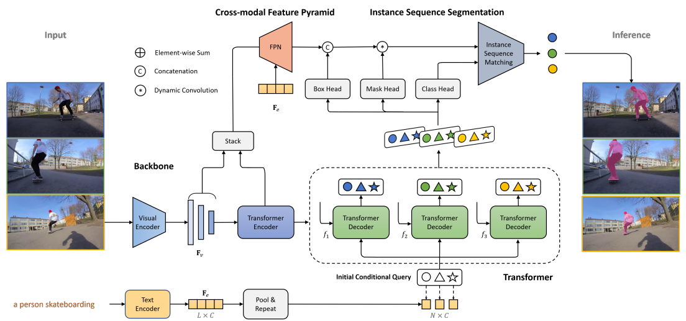

 
## arXiv 2022
+ Backbone is All Your Need: A Simplified Architecture for Visual Object Tracking. arXiv 2022-03  
Boyu Chen, Peixia Li, Lei Bai, Lei Qiao, Qiuhong Shen, Bo Li, Weihao Gan, Wei Wu, Wanli Ouyang    
[[paper](https://arxiv.org/pdf/2203.05328)]  

+ RGBD Object Tracking: An In-depth Review. arXiv 2022-03  
Jinyu Yang, Zhe Li, Song Yan, Feng Zheng, Aleš Leonardis, Joni-Kristian Kämäräinen, Ling Shao    
[[paper](https://arxiv.org/abs/2203.14134)]  [[code](https://github.com/memoryunreal/RGBD-tracking-review)]

+ BCOT: A Markerless High-Precision 3D Object Tracking Benchmark. arXiv 2022-03  
Jiachen Li, Bin Wang, Shiqiang Zhu, Xin Cao, Fan Zhong, Wenxuan Chen, Te Li, Jason Gu, Xueying Qin    
[[paper](https://arxiv.org/abs/2203.13437)]  [[code](https://ar3dv.github.io/BCOT-Benchmark/)]

+ Efficient Visual Tracking via Hierarchical Cross-Attention Transformer. arXiv 2022-03  
Xin Chen, Dong Wang, Dongdong Li, Huchuan Lu    
[[paper](https://arxiv.org/abs/2203.13537)]  [[code](https://github.com/chenxin-dlut/HCAT)]

## CVPR 2022

+ Beyond 3D Siamese Tracking: A Motion-Centric Paradigm for 3D Single Object Tracking in Point Clouds. CVPR 2022  
Chaoda Zheng, Xu Yan, Haiming Zhang, Baoyuan Wang, Shenghui Cheng, Shuguang Cui, Zhen Li     
[[paper](https://arxiv.org/pdf/2203.01730.pdf)] [[code](https://github.com/Ghostish/Open3DSOT)] 

+ Correlation-Aware Deep Tracking. CVPR 2022  
Fei Xie, Chunyu Wang, Guangting Wang, Yue Cao, Wankou Yang, Wenjun Zeng    
[[paper](https://arxiv.org/abs/2203.01666)] [code]

+ Global Tracking via Ensemble of Local Trackers. CVPR 2022  
Zikun Zhou, Jianqiu Chen, Wenjie Pei, Kaige Mao, Hongpeng Wang, Zhenyu He    
[[paper](https://arxiv.org/pdf/2203.16092.pdf)] [code] 

+ Iterative Corresponding Geometry: Fusing Region and Depth for Highly Efficient 3D Tracking of Textureless Objects. CVPR 2022  
Manuel Stoiber, Martin Sundermeyer, Rudolph Triebel    
[[paper](https://arxiv.org/abs/2203.05334)] [[code](https://github.com/DLR-RM/3DObjectTracking)]  

+ Language as Queries for Referring Video Object Segmentation. CVPR2022  
Jiannan Wu, Yi Jiang, Peize Sun, Zehuan Yuan, Ping Luo  
[[paper](https://arxiv.org/abs/2201.00487)] [[code](https://github.com/wjn922/ReferFormer)] 
  
 
    
Notes

       

    - Key idea:
         - Viewing the language as queries to attend to the most relevant regions
         - Performing tracking by linking the corresponding queries across frames
     - Performance: 
        - 55.6(resnet50)/64.2(swin-large) J&F on Ref-Youtube-VOS; 
        - 55.0 mAP on A2D-Sentences; 
        - 43.7 mAP on JHMDB-Sequences
    

+ MixFormer: End-to-End Tracking with Iterative Mixed Attention. CVPR 2022  
Yutao Cui, Cheng Jiang, Limin Wang, Gangshan    
[[paper](https://arxiv.org/pdf/2203.11082.pdf)] [[code](https://github.com/MCG-NJU/MixFormer)]  

+ Transforming Model Prediction for Tracking. CVPR 2022  
Christoph Mayer, Martin Danelljan, Goutam Bhat, Matthieu Paul, Danda Pani Paudel, Fisher Yu, Luc Van Gool       
[[paper](https://arxiv.org/abs/2203.11192)] [[code](https://github.com/visionml/pytracking)] 

+ TCTrack: Temporal Contexts for Aerial Tracking. CVPR 2022  
Ziang Cao, Ziyuan Huang, Liang Pan, Shiwei Zhang, Ziwei Liu, Changhong Fu     
[[paper](https://arxiv.org/pdf/2203.01885.pdf)] [[code](https://github.com/vision4robotics/TCTrack)] 

+ Unsupervised Domain Adaptation for Nighttime Aerial Tracking. CVPR 2022  
Junjie Ye, Changhong Fu, Guangze Zheng, Danda Pani Paudel, Guang Chen     
[[paper](https://arxiv.org/abs/2203.10541)] [[code](https://github.com/vision4robotics/UDAT)] 

+ Unified Transformer Tracker for Object Tracking. CVPR2022  
Fan Ma, Mike Zheng Shou, Linchao Zhu, Haoqi Fan, Yilei Xu, Yi Yang, Zhicheng Yan   
[[paper](https://arxiv.org/pdf/2203.15175.pdf)] [code]

+ Unsupervised Learning of Accurate Siamese Tracking. CVPR2022  
Qiuhong Shen, Lei Qiao, Jinyang Guo, Peixia Li, Xin Li, Bo Li, Weitao Feng, Weihao Gan, Wei Wu, Wanli Ouyang   
[paper] [code]

+ Visible-Thermal UAV Tracking: A Large-Scale Benchmark and New Baseline. CVPR2022  
Pengyu Zhang, Jie Zhao, Dong Wang, Huchuan Lu, Xiang Ruan  
[paper] [code]

## arXiv 2021

+ Efficient Visual Tracking with Exemplar Transformers. arXiv 2021-12  
Philippe Blatter, Menelaos Kanakis, Martin Danelljan, Luc Van Gool  
[[paper](https://arxiv.org/pdf/2112.09686.pdf)]   

+ SwinTrack: A Simple and Strong Baseline for Transformer Tracking. arXiv 2021-12  
Liting Lin, Heng Fan, Yong Xu, Haibin Ling  
[[paper](https://arxiv.org/pdf/2112.00995.pdf)] [[code](https://github.com/LitingLin/SwinTrack)]  

## ICCV 2021  
+ Box-Aware Feature Enhancement for Single Object Tracking on Point Clouds. ICCV 2021  
Chaoda Zheng, Xu Yan, Jiantao Gao, Weibing Zhao, Wei Zhang, Zhen Li, Shuguang Cui   
[[paper](https://openaccess.thecvf.com/content/ICCV2021/papers/Zheng_Box-Aware_Feature_Enhancement_for_Single_Object_Tracking_on_Point_Clouds_ICCV_2021_paper.pdf)] [[code](https://github.com/Ghostish/BAT)]  

+ DepthTrack: Unveiling the Power of RGBD Tracking. ICCV 2021  
Song Yan, Jinyu Yang, Jani Kapyl¨ a¨, Feng Zheng, Ales Leonardis, Joni-Kristian Kam¨ ar¨ ainen      
[[paper](https://openaccess.thecvf.com/content/ICCV2021/papers/Yan_DepthTrack_Unveiling_the_Power_of_RGBD_Tracking_ICCV_2021_paper.pdf)] [[code](https://github.com/xiaozai/DeT)]  

+ HiFT: Hierarchical Feature Transformer for Aerial Tracking. ICCV 2021  
Ziang Cao, Changhong Fu, Junjie Ye, Bowen Li, Yiming Li     
[[paper](https://openaccess.thecvf.com/content/ICCV2021/papers/Cao_HiFT_Hierarchical_Feature_Transformer_for_Aerial_Tracking_ICCV_2021_paper.pdf)] [[code](https://github.com/vision4robotics/HiFT)]  

+ High-Performance Discriminative Tracking with Transformers. ICCV 2021  
Bin Yu, Ming Tang, Linyu Zheng, Guibo Zhu, Jinqiao Wang, Hao Feng, Xuetao Feng, Hanqing Lu     
[[paper](https://openaccess.thecvf.com/content/ICCV2021/papers/Yu_High-Performance_Discriminative_Tracking_With_Transformers_ICCV_2021_paper.pdf)] 

+ Learning Spatio-Temporal Transformer for Visual Tracking. ICCV 2021  
Bin Yan, Houwen Peng, Jianlong Fu, Dong Wang, Huchuan Lu   
[[paper](https://openaccess.thecvf.com/content/ICCV2021/papers/Yan_Learning_Spatio-Temporal_Transformer_for_Visual_Tracking_ICCV_2021_paper.pdf)] [[code](https://github.com/researchmm/Stark)]  

+ Learning Target Candidate Association to Keep Track of What Not to Track. ICCV 2021  
Christoph Mayer, Martin Danelljan, Danda Pani Paudel, Luc Van Gool  
[[paper](https://openaccess.thecvf.com/content/ICCV2021/papers/Mayer_Learning_Target_Candidate_Association_To_Keep_Track_of_What_Not_ICCV_2021_paper.pdf)] [[code](https://github.com/visionml/pytracking)]  

+ Learning to Adversarially Blur Visual Object Tracking. ICCV 2021  
Qing Guo, Ziyi Cheng, Felix Juefei-Xu, Lei Ma, Xiaofei Xie, Yang Liu, Jianjun Zhao  
[[paper](https://openaccess.thecvf.com/content/ICCV2021/papers/Guo_Learning_To_Adversarially_Blur_Visual_Object_Tracking_ICCV_2021_paper.pdf)] [[code](https://github.com/tsingqguo/ABA)]  

+ Learn to Match: Automatic Matching Network Design for Visual Tracking. ICCV 2021  
Zhipeng Zhang, Yihao Liu, Xiao Wang, Bing Li, Weiming Hu  
[[paper](https://openaccess.thecvf.com/content/ICCV2021/papers/Zhang_Learn_To_Match_Automatic_Matching_Network_Design_for_Visual_Tracking_ICCV_2021_paper.pdf)] [[code](https://github.com/JudasDie/SOTS)]  

+ Learning to Track Objects from Unlabeled Videos. ICCV 2021  
Jilai Zheng, Chao Ma, Houwen Peng, Xiaokang Yang     
[[paper](https://openaccess.thecvf.com/content/ICCV2021/papers/Zheng_Learning_To_Track_Objects_From_Unlabeled_Videos_ICCV_2021_paper.pdf)] [[code](https://github.com/VISION-SJTU/USOT)]  

+ MLVSNet: Multi-level Voting Siamese Network for 3D Visual Tracking. ICCV 2021  
Zhoutao Wang, Qian Xie, Yu-Kun Lai, Jing Wu, Kun Long, Jun Wang   
[[paper](https://openaccess.thecvf.com/content/ICCV2021/papers/Wang_MLVSNet_Multi-Level_Voting_Siamese_Network_for_3D_Visual_Tracking_ICCV_2021_paper.pdf)] [[code](https://github.com/CodeWZT/MLVSNet)]  

+ Object Tracking by Jointly Exploiting Frame and Event Domain. ICCV 2021  
Jiqing Zhang, Xin Yang, Yingkai Fu, Xiaopeng Wei, Baocai Yin, Bo Dong      
[[paper](https://openaccess.thecvf.com/content/ICCV2021/papers/Zhang_Object_Tracking_by_Jointly_Exploiting_Frame_and_Event_Domain_ICCV_2021_paper.pdf)] 

+ R-SLAM: Optimizing Eye Tracking from Rolling Shutter Video of the Retina. ICCV 2021  
Jay Shenoy, James Fong, Jeffrey Tan, Austin Roorda, Ren Ng     
[[paper](https://openaccess.thecvf.com/content/ICCV2021/papers/Shenoy_R-SLAM_Optimizing_Eye_Tracking_From_Rolling_Shutter_Video_of_the_ICCV_2021_paper.pdf)] 

+ Saliency-Associated Object Tracking. ICCV 2021  
Zikun Zhou, Wenjie Pei, Xin Li, Hongpeng Wang, Feng Zheng, Zhenyu He     
[[paper](https://openaccess.thecvf.com/content/ICCV2021/papers/Zhou_Saliency-Associated_Object_Tracking_ICCV_2021_paper.pdf)] [[code](https://github.com/ZikunZhou/SAOT)]  

+ Transparent Object Tracking Benchmark. ICCV 2021  
Heng Fan, Halady Akhilesha Miththanthaya, Harshit, Siranjiv Ramana Rajan, Xiaoqiong Liu, Zhilin Zou, Yuewei Lin, Haibin Ling      
[[paper](https://openaccess.thecvf.com/content/ICCV2021/papers/Fan_Transparent_Object_Tracking_Benchmark_ICCV_2021_paper.pdf)] [[code](https://hengfan2010.github.io/projects/TOTB/)]  

+ Video Annotation for Visual Tracking via Selection and Refinement. ICCV 2021  
Kenan Dai, Jie Zhao, Lijun Wang, Dong Wang, Jianhua Li, Huchuan Lu, Xuesheng Qian, Xiaoyun Yang  
[[paper](https://openaccess.thecvf.com/content/ICCV2021/papers/Dai_Video_Annotation_for_Visual_Tracking_via_Selection_and_Refinement_ICCV_2021_paper.pdf)] [[code](https://github.com/Daikenan/VASR)]  

+ You Don’t Only Look Once: Constructing Spatial-Temporal Memory for Integrated 3D Object Detection and Tracking. ICCV 2021  
Jiaming Sun, Yiming Xie, Siyu Zhang, Linghao Chen, Guofeng Zhang, Hujun Bao, Xiaowei Zhou  
[[paper](https://openaccess.thecvf.com/content/ICCV2021/papers/Sun_You_Dont_Only_Look_Once_Constructing_Spatial-Temporal_Memory_for_Integrated_ICCV_2021_paper.pdf)] [[code](https://zju3dv.github.io/UDOLO)]  

